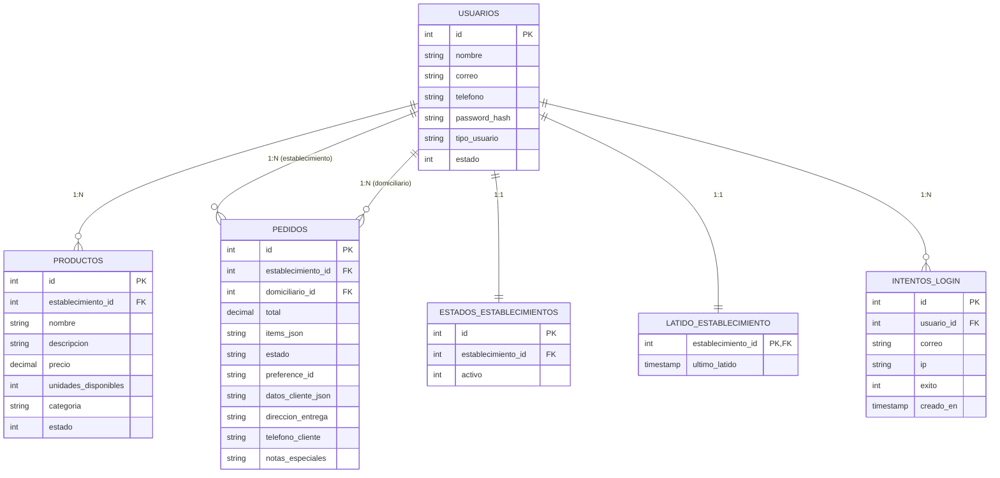

# Modelo Relacional Optimizado - SnappyVistas

## Diagrama Mermaid (Solo campos utilizados)

## Campos Eliminados

### USUARIOS
- ❌ `creado_en` - No se consulta
- ❌ `actualizado_en` - No se consulta

### PRODUCTOS  
- ❌ `imagen_url` - No se utiliza
- ❌ `creado_en` - No se consulta
- ❌ `actualizado_en` - No se consulta

### PEDIDOS
- ❌ `created_at` - No se consulta
- ❌ `updated_at` - Solo se actualiza pero no se consulta

### ESTABLECIMIENTOS_ESTADO
- ❌ `fecha_activacion` - No se utiliza
- ❌ `fecha_desactivacion` - No se utiliza  
- ❌ `motivo_desactivacion` - No se utiliza
- ❌ `creado_en` - No se consulta
- ❌ `actualizado_en` - No se consulta

## Beneficios de la Limpieza

1. **Menor tamaño de base de datos** - Menos campos = menos espacio
2. **Mejor rendimiento** - Menos datos que procesar
3. **Estructura más clara** - Solo campos que realmente se usan
4. **Mantenimiento más fácil** - Menos campos que gestionar
5. **Consultas más rápidas** - Menos columnas en SELECT *

## Instrucciones de Aplicación

1. **Hacer backup** de la base de datos actual
2. **Ejecutar** `limpiar_atributos_no_utilizados.sql`
3. **Verificar** que todo funciona correctamente
4. **Usar** `snappy_simple_limpio.sql` para nuevas instalaciones
